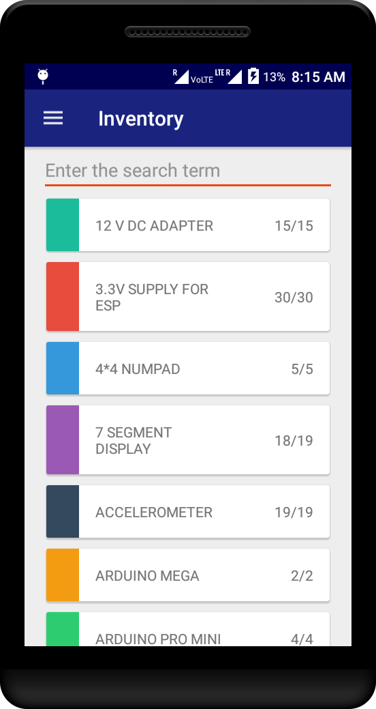

# Component Hub

</img>

An android application to handle the issue/return of electronic items. This was put to test at [SELECT school, VIT University](http://vit.ac.in/academics/schools/select "SELECT, VIT"). 

The application allowed the students to login with a provided student registration number and an associated password. After the login, the student needs to scan the barcode on the partcular item and it is registered under their name. The student can view the available inventory as well as the issued items under the particular ID.

# Screenshots
</img> </img> </img> 

# Download
The application can be checked out [here](https://drive.google.com/open?id=0B_KFChxLPJ41ZDZFZDNVZVpyUlU).
